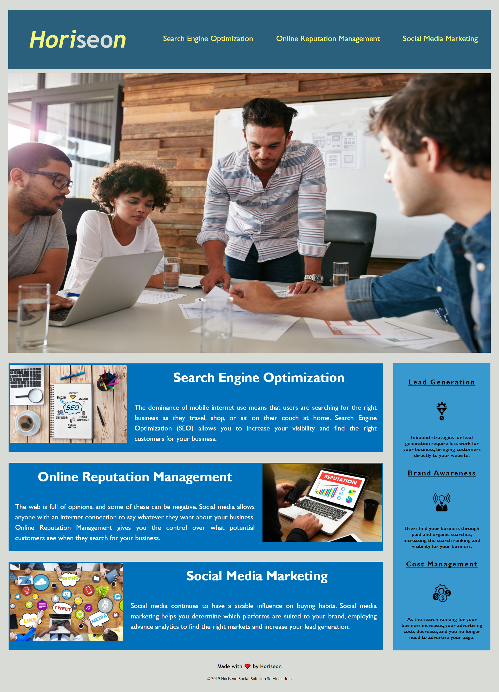
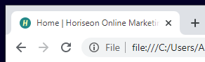

 

## **accessible horiseon** 
 

[https://aranata.github.io/accessible-horiseon/](https://aranata.github.io/accessible-horiseon/) 
 
 

## description

***

This is an assignment to refactor an existing codebase to follow a group of accessibility standards so that it is 
optimized for search engines. The existing codebase was re-structured by using semantic elements with 
adherence to both logical squence and priority traits. This enabled the containers to share relevant information 
about the nature of their contents with the search engines. Codebase was simplified, redundant and unused coding were cleared for better accessibility. Such changes transformed the page into a much more recognizable, visible one. 
While doing so, other accessibility factors like better readability and easy orientation were addressed by improving the visual distinction among the elements of the layout. Text visibility was enhanced by better line height - font size proportions and an icon was included in the title element. Written definitions were added to all
images and logos via 
accessible alt attributes to support screen readers. This work was completed by using HTML and CSS coding. 
 

## acceptance criteria

***

The refactored codebase achieves the following criteria:  

* GIVEN a webpage meets accessibility standards:
* WHEN we view the source code; THEN I find semantic HTML elements. 
* WHEN I view the structure of the HTML elements; THEN I find that the elements follow a logical 
structure independent of styling and positioning.
* WHEN I view the image elements; THEN I find accessible alt attributes.
* WHEN I view the heading attributes; THEN they fall in sequential order.
* WHEN I view the title element; THEN I find a concise, descriptive title.
 
 

## usage

***

Here are the screenshots of the refactored page (up) and the old page (bottom) in full view. Layout elements like the 
header (heading + navigation), the main image, the main body with three sections, the aside container that also comes 
with three sections and the footer were treated distinctively so as to improve their hierarchy and readability. 
Best viewed at full screen, 16:10 aspect ratio.
 

 
 

 
 

"The title tag is an important SEO ranking signal and a key contributor to your click through rates." states website.com 
in its web site listed among the references below. There was no title element to begin with so it was defined to reflect 
the page's identity as much as possible.
 

 
 

## some valuable references

***

These links are listing some valuable references among others that I used doing this project:

[https://inviqa.com/blog/web-accessibility-examples-5-sites-doing-it-right](https://inviqa.com/blog/web-accessibility-examples-5-sites-doing-it-right)

[https://favicon.io/favicon-generator/](https://favicon.io/favicon-generator/)

[https://github.com/noffle/art-of-readme](https://github.com/noffle/art-of-readme)

[https://html.com/semantic-markup/](https://html.com/semantic-markup/)

[https://shields.io/category/dependencies/](https://shields.io/category/dependencies/)

[https://www.website.com/beginners-guide-to-seo#:~:text=Search%20Engine%20Optimization%20%2D%20or%20SEO,content%20to%20the%20right%20people.](https://www.website.com/beginners-guide-to-seo#:~:text=Search%20Engine%20Optimization%20%2D%20or%20SEO,content%20to%20the%20right%20people.)
 
 

## credits

***

Stephen Woosley - Bootcamp Instructor 
Patrick Haberern - Bootcamp TA 
Tim Nagorski - Bootcamp TA 
Sean Walmer - Bootcamp TA 
[https://github.com/vegaryanneil](https://github.com/vegaryanneil) 
[https://github.com/zchalk](https://github.com/zchalk) 
[https://github.com/zackshersh](https://github.com/zackshersh) 
 
 

## license

***

This is an assigment done under a bootcamp program, it is public but please contact the publisher before you use or 
change any content. 
ghibli.github@gmail.com
 
 

## badges

***

 
 

## ps

***

This particular readme file is the very first readme file I created. 

---
